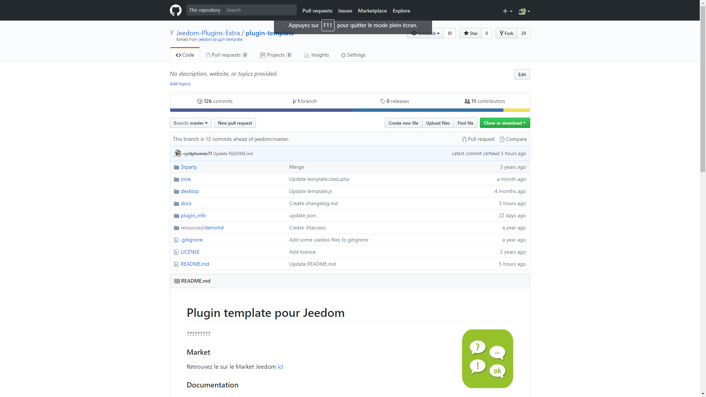

# Plugin template pour Jeedom

?????????

### Market

Retrouvez le sur le Market Jeedom [ici](https://www.jeedom.com/market/index.php?v=d&p=market&type=plugin&&name=template)

### Documentation

Vous trouverez la documentation [ici](https://github.com/Jeedom-Plugins-Extra/template/blob/stable/doc/fr_FR/index.asciidoc)

### Prévisualisation

### Forum

Lien vers le forum [ici](https://www.jeedom.com/forum/viewtopic.php?f=142&t=34154)

### Chatroom

Lien vers le chat [ici](https://gitter.im/Jeedom-Plugins-Extra/plugin-template)

### Fonctions disponibles

Infos :
* ?????

Actions :
* ?????

Scénarios possible (ceux que j'ai chez moi) :
* ?????
